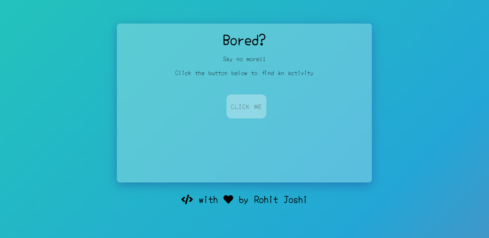

# 
 Bored??😒 

<h4>Use this website to find activities to kill your boredom.</h4>

- Tech used:
  - HTML (Basic Structure of the page)
  - CSS (Glassmorphism, Media Queries)
  - JS (Fetching api, TextContent)
  - Bored api
 

- Link to website: https://rohitjoshi6.github.io/Bored-Website/
 

- Screenshots:

<h4>With breakpoint at 600px: </h4> 

